<style>
   @import url('https://fonts.googleapis.com/css2?family=Noto+Sans+KR:wght@500&family=Noto+Serif+KR:wght@500&display=swap');

    {
      font-family: 'Noto Sans KR', serif;
    }
    h3 {
      font-size: 28px;
    }
    h4 {
     font-size: 23px;
    }
    code {
     font-size: 18px;
    }
</style>

# React의 차세대 상태관리, Jotai 👻

<br/>

_쇼핑검색 FE 서상혁_

---

# State Management

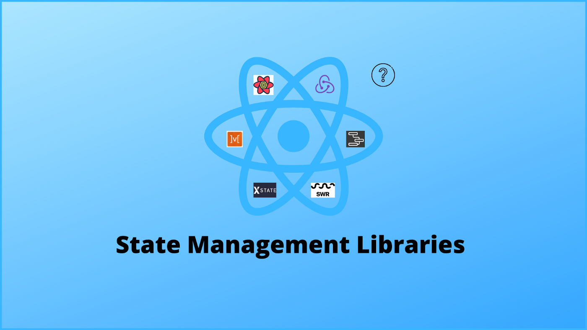

---

# State Management

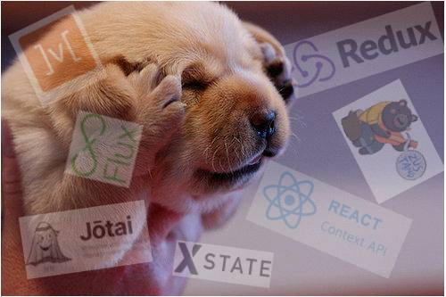

---

<style>
  li {
    font-size: 26px;
  }
</style>

# State Management

### 상태관리 라이브러리들의 역사

- 2013 - React 등장
- 2014 - Flux (다양한 라이브러리 등장)
- 2015 - Redux
- 2016 - MobX
- 2018 - Context
- 2019 - Hooks 등장 (+ React Query, SWR)
- 2019 - Zustand
- 2019 - xState
- 2020 - Recoil, Jotai, Valtio
- 2021 - use-context-selector

---

# State Management

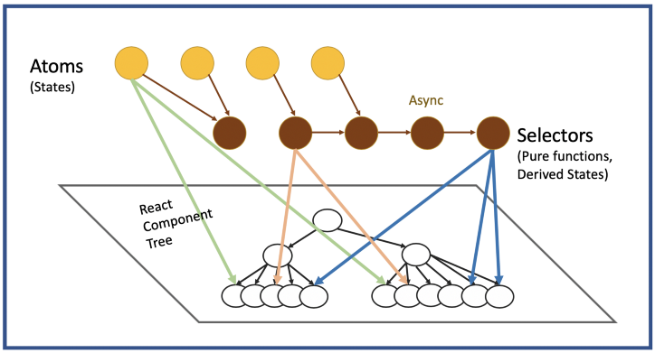

---

# Jotai?

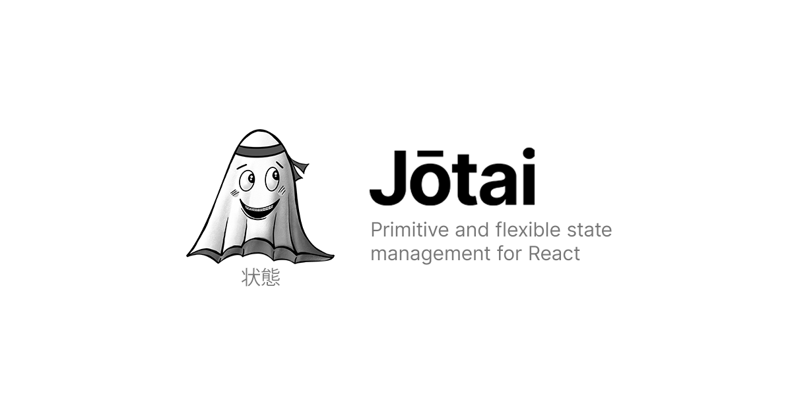

- `원시적이고 유동적인 리액트의 상태관리`
- Jotai = 일본어로 'State'

  <style scoped>
  blockquote {
  font-size: 22px;
  }
  </style>

  > Jotai is pronounced "joe-tie" and means "state" in Japanese.

---

# Jotai의 탄생

- recoil에 영감을 받아서 탄생
- 2020.08 에 `Pmdnrs` 에 의해 만들어진 상태관리 라이브러리
- [Pmdnrs](https://github.com/pmndrs) 란?
  - 자바스크립트 기반의 오픈소스 개발자 모임
  - react-spring, react-three-fiber, zustand 등

---

# Why Jotai? 🧐

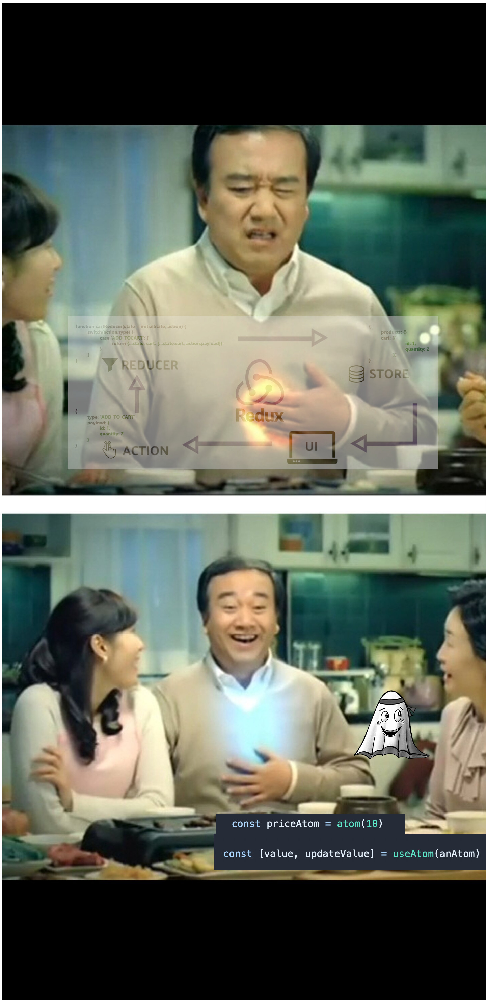

---

<style scoped>
  p {
    font-size: 15px
  }
</style>

## Rising Stars.js - Stage management

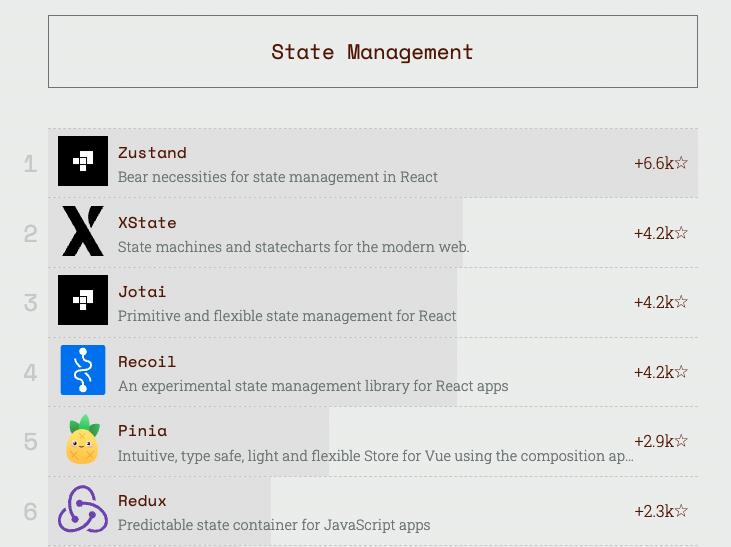

https://risingstars.js.org/2021/en#section-statemanagement

---

# Jotai VS Recoil

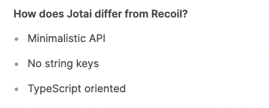

---

<style scoped>
  li {
    font-size: 22px;
  }
</style>

# Jotai VS Recoil

### 그 외에도

- recoil은 아직 v0.6.1 (`facebookexperimental/recoil`)
- react-suspense 를 고려하여 설계됨
- recoil 은 javaScript로 작성, jotai는 typeScript로 작성
- bundle size의 큰 차이

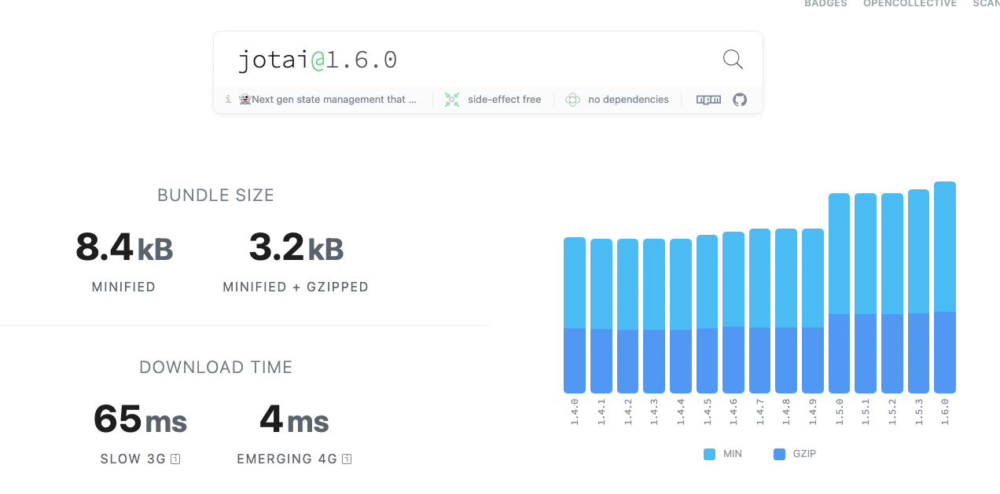 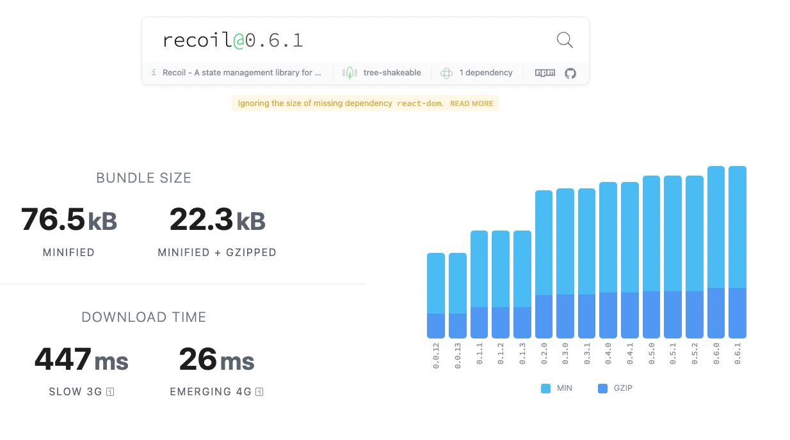

---

# Jotai VS Recoil

recoil 　　　　　　　　　　　　 jotai

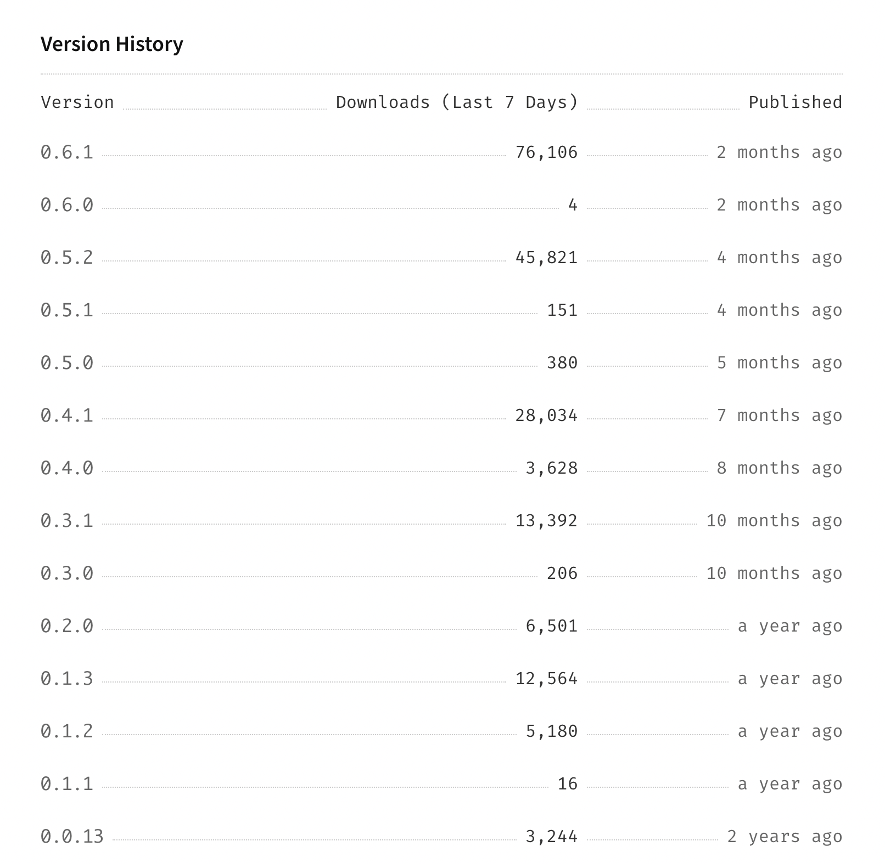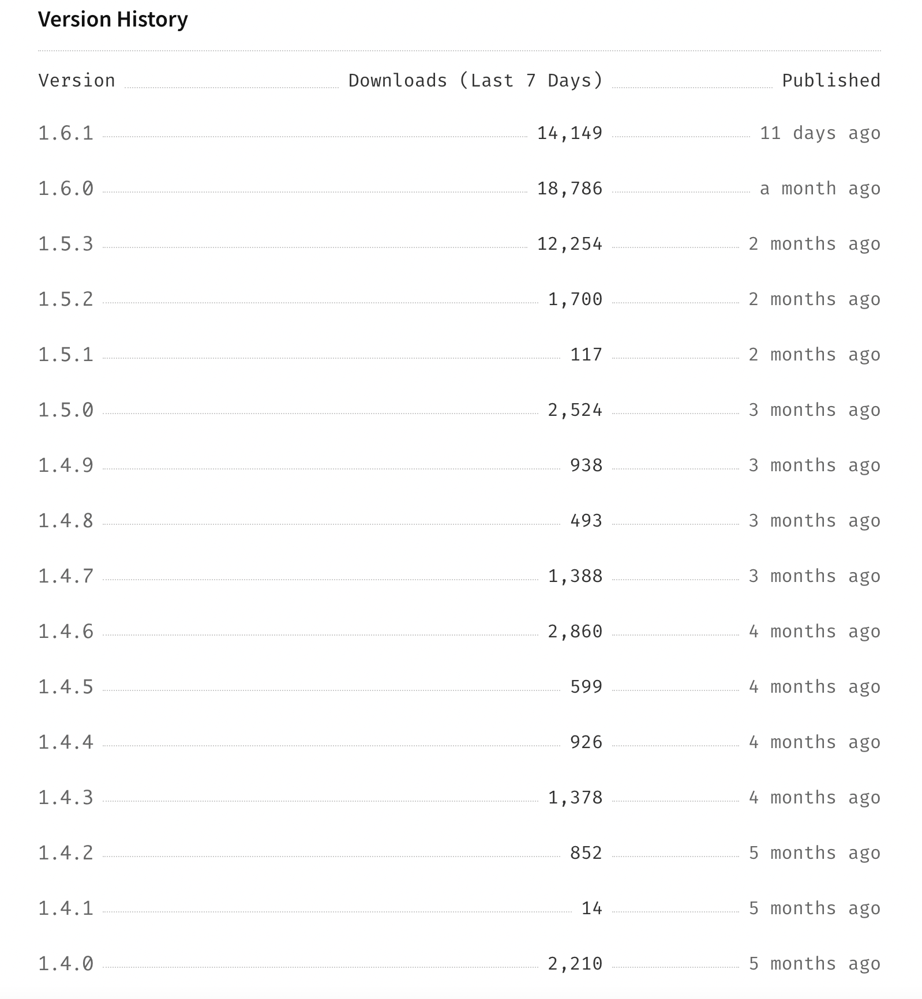

---

<style>
  table {
    font-size: 18px;
  }
</style>

# Jotai VS Zustand

|                | Jotai                                         | Zustand                   |
| -------------- | --------------------------------------------- | ------------------------- |
| Github Stars⭐ | 6.8k                                          | 12.7k                     |
| state 모델     | primitive atoms 형태                          | 단일 스토어 형태          |
| 형태           | useState 의 인터페이스를 기반으로한 여러 util | useStore 로 거의 단일화됨 |
| 방식           | Bottom-up                                     | Top-down                  |
| Provider       | 일반적으로는 필요함                           | 필요 없음                 |
| 바닐라 JS      | X (React 만 지원)                             | O                         |
| SSR            | O                                             | ?                         |
| Suspense       | O                                             | ?                         |
| devtool        | O                                             | O                         |

---

# Key Feature


- Primitive?
- Flexible?

---

<style scoped>
  li {
    font-size: 24px
  }
</style>

# Key Feature


- Primitive :
  - atom 하나 하나가 각자의 개별 state
  - 리액트 기본 state 함수인 useState 와 유사한 인터페이스
- Flexible
  - atom들끼리 서로 결합 및 상태에 관여
  - 다른 라이브러리들과 원할한 결합

---

<style>
img[alt~="center"] {
  display: block;
  margin: 0 auto;
}
</style>

# How to?


---

## atom

#### atom 선언

```ts
import { atom } from "jotai"

export const priceAtom = atom(10)
export const productAtom = atom<Product>({ id: 12, name: "good stuff" })
```

#### atom 사용

```tsx
const Component = () => {
  const [price, setPrice] = useAtom(priceAtom) //                  .
  const [product, setProduct] = useAtom(productAtom)

  return <>...</>
}
```

---

<style scoped>
  code {
    font-size: 17px
  }
</style>

## readonly atom

#### 선언

```ts
export const priceAtom = atom(1000)

// readOnly Atom
export const discountedPriceAtom = atom((get) => get(priceAtom) * 0.5)
```

#### 사용

```tsx
const Component = () => {
  const discountedPrice = useAtomValue(discountedPriceAtom)
  // const [discountedPrice, _] = useAtom(discountedPriceAtom)

  return <>{discountedPrice}</>
}
```

---

<style scoped>
  code {
    font-size: 17px
  }
</style>

## writeonly Atom

#### 선언

```ts
// writeOnly Atom                                                        .
export const increasePriceAtom = atom(null, (get, set, rate) => {
  const prevPrice = get(priceAtom)
  set(priceAtom, prevPrice * rate)
})
```

#### 사용

```tsx
const IncreasePriceButton = () => {
  const increasePrice = useUpdateAtom(increasePriceAtom) //           .
  // const [_, increasePrice] = useAtom(increasePriceAtom)

  return <button onClick={increasePrice}>가격인상</button>
}
```

---

<style scoped>
  code {
    font-size: 17px
  }
</style>

### redux 예시

```ts
const initialState = {
  productList: [],
  selectedProduct: null
  selectedProductIndex: 0,
}

reducers: {
  // dependant한 state 또한 같이 변화시킴.
  setSelectedProductIndex(state, { payload }) {
      state.productIndex = payload.index
      state.selectedProduct = state.productList[payload.index]
    },
}
```

### jotai 예시

```ts
const productListAtom = atom([])
const selectedProductIndexAtom = atom(0)

//  state 자체가 dependant 하게 선언이 됨.
const selectedProductAtom = atom((get) => {
  const productList = get(productListAtom)
  const productIndex = get(selectedProductIndexAtom)
  return productList[productIndex]
})

// const setSelectedProductIndex = useUpdateAtom(selectedProductIndexAtom)
```

---

<style scoped>
  code {
    font-size: 17px
  }
</style>

## Provider 와 Scope

### Provider

```tsx
const Provider: React.FC<{
  initialValues?: Iterable<readonly [AnyAtom, unknown]>
  scope?: Scope
}>
```

- jotai 는 기본적으로 Provider가 Optional

---

<style scoped>
  code {
    font-size: 17px
  }
</style>

## Provider 와 Scope

### initialValues

```ts
const TestRoot = () => (
  <Provider
    initialValues={[
      [atom1, 1],
      [atom2, "b"],
    ]}>
    <Component />
  </Provider>
)
```

- SSR 시에 이 initialValues에 넣어줌

---

## scope

<style scoped>
  code {
    font-size: 17px
  }
</style>

```ts
const myScope = Symbol()
const anAtom = atom("")

const LibraryRoot = ({ children }) => (
  <Provider scope={myScope}>{children}</Provider>
)

const LibraryComponent = () => {
  const [value, setValue] = useAtom(anAtom, myScope)
  // ...
}
```

- scope는 중복되지 않게 symbol로 선언
- 같은 atom도, scope에 따라 다른 값을 가짐

---

### `jotai/src/core`

#### `atom.ts`

```ts
export function atom<Value, Update, Result extends void | Promise<void>>(
  read: Value | Read<Value>,
  write?: Write<Update, Result>
) {
  const key = `atom${++keyCount}`
  const config = {
    toString: () => key,
  } as WritableAtom<Value, Update, Result> & { init?: Value }
  if (typeof read === "function") {
    config.read = read as Read<Value>
  } else {
    config.init = read
    config.read = (get) => get(config)
    config.write = (get, set, update) =>
      set(config, typeof update === "function" ? update(get(config)) : update)
  }
  if (write) {
    config.write = write
  }
  return config
}
```

---

## scope

```ts
const rootScope = Symbol()
const scopeA = Symbol()
const scopeB = Symbol()
const Root = ({ children }) => <Provider scope={rootScope}>{children}</Provider>
const A = ({ children }) => <Provider scope={scopeA}>{children}</Provider>
const B = ({ children }) => <Provider scope={scopeB}>{children}</Provider>

const App = () => {
  return (
    <>
      <Root>
        <A>
          <Component />
        </A>
        <B>
          <Component2 />
        </B>
      </Root>
    </>
  )
}
```

- multiple provider

---

## async

```ts
const dollarPriceAtom = atom(5) // 5달러

const koreanPriceAtom = atom(async (get) => {
  const dollarPrice = get(dollarPriceAtom)
  const exchangedRate = await getExchangedRate() // 외부에서 환율 정보를 가져온 뒤 계산
  return dollarPrice * exchangedRate
})

// async atom
const halfPriceAtom = atom((get) => get(koreanPriceAtom) / 2)

// 사용 예시
const Component = () => {
  const [koreanPrice] = useAtom(koreanPriceAtom)
  ...
}
```

---

## Suspense

<style scoped>
  code {
    font-size: 19px
  }
</style>

```ts
const App = () => (
  <Provider>
    <Suspense fallback='Loading...'>
      <Component />
    </Suspense>
  </Provider>
)
```

---

## 리렌더링 최소화

<style scoped>
 strong {
   color: #4D77FF;
 }
</style>

> **Jotai was born to solve extra re-render issue in React**. Extra re-render is a render process that produces the same UI result, with which users won't see any differences.

---

### `jotai/src/core`

#### `context.ts`

```ts
type ScopeContext = Context<ScopeContainer>

const ScopeContextMap = new Map<Scope | undefined, ScopeContext>()

export const getScopeContext = (scope?: Scope) => {
  if (!ScopeContextMap.has(scope)) {
    ScopeContextMap.set(scope, createContext(createScopeContainer()))
  }
  return ScopeContextMap.get(scope) as ScopeContext
}
```

#### `useAtomValue.ts`

```ts
export function useAtomValue<Value>(
  atom: Atom<Value>,
  scope?: Scope
): ResolveType<Value> {
  const ScopeContext = getScopeContext(scope) //                     .
  const { s: store } = useContext(ScopeContext)
  ...
}
```

---

<style scoped>
  code {
    font-size: 19px
  }
</style>

## 리렌더링 최소화

### 큰 오브젝트 형태의 state가 있다고 가정

```ts
const defaultPerson = {
  name: {
    first: "Jane",
    last: "Doe",
  },
  birth: {
    year: 2000,
    month: "Jan",
    day: 1,
    time: {
      hour: 1,
      minute: 1,
    },
  },
}

const personAtom = atom(defaultPerson)
```

---

## 리렌더링 최소화

### selectAtom

```ts
const defaultPerson = {
  name: {
    ...
  },
  birth: {
    ...
  },
}
const personAtom = atom(defaultPerson)

const nameAtom = selectAtom(personAtom, (person) => person.name)
```

- personAtom 의 name 에 해당하는 개별 atom
- nameAtom 은 person.name 이 바뀌었을때만 리렌더링.
  (예를들어 birth 가 바뀌었을 때는 리렌더 x)

---

## 리렌더링 최소화

### selectAtom

```tsx
const birthAtom = selectAtom(personAtom, (person) => person.birth, deepEquals)
```

- deepEquals 옵션
- 위의 케이스는 오브젝트의 참조값을 가지고 비교를 했다면
- deepEquals 옵션을 이용하면 직접 타고들어가 값 자체를 비교해서 리렌더링 여부를 결정

---

<style scoped>
  li {
    font-size: 22px;
  }
</style>

## 리렌더링 최소화

### focusAtom

```ts
import { atom } from "jotai"
import { focusAtom } from "jotai/optics"

const objectAtom = atom({ a: 5, b: 10 })
const aAtom = focusAtom(objectAtom, (optic) => optic.prop("a"))
const bAtom = focusAtom(objectAtom, (optic) => optic.prop("b"))

const Controls = () => {
  const [a, setA] = useAtom(aAtom)
  const [b, setB] = useAtom(bAtom)
  return (
    <div>
      <span>Value of a: {a}</span>
      <span>Value of b: {b}</span>
      <button onClick={() => setA((oldA) => oldA + 1)}>Increment a</button>
      <button onClick={() => setB((oldB) => oldB + 1)}>Increment b</button>
    </div>
  )
}
```

- optics 활용
- selectAtom 와 매우 유사하나, write 도 가능한 atom을 만들고 싶을 경우 사용

---

<style scoped>
li {
  font-size: 22px;
}
</style>

## 리렌더링 최소화

### splitAtom

```ts
import { splitAtom } from "jotai/utils"

const peopleAtomsAtom = splitAtom(peopleAtom)

const People = () => {
  const [peopleAtoms] = useAtom(peopleAtomsAtom)
  return (
    <div>
      {peopleAtoms.map((personAtom) => (
        <Person personAtom={personAtom} key={`${personAtom}`} />
      ))}
    </div>
  )
}
```

- 각 Person 컴퍼넌트에 전달된 값들은 서로다른 personAtom 으로 만들어진다.
- 따라서, 다른 atom이 변경된다 하더라도 서로 리렌더링을 일으키지 않는다.

---

<style scoped>
li {
  font-size: 24px;
}
</style>

## 그 외

### atomWithStorage

```ts
import { useAtom } from "jotai"
import { atomWithStorage } from "jotai/utils"

const darkModeAtom = atomWithStorage("darkMode", false)

const Page = () => {
  const [darkMode, setDarkMode] = useAtom(darkModeAtom)

  return (
    <>
      <h1>Welcome to {darkMode ? "dark" : "light"} mode!</h1>
      <button onClick={() => setDarkMode(!darkMode)}>toggle theme</button>
    </>
  )
}
```

- `localStorage`, `sessionStorage`, `AsyncStorage` 모두 지원
- SSR 불가능

---

## 그 외

<style scoped>
li {
  font-size: 24px;
}
</style>

### atomWithQuery

```ts
import { useAtom } from "jotai"
import { atomWithQuery } from "jotai/query"

const idAtom = atom(1)
const userAtom = atomWithQuery((get) => ({
  queryKey: ["users", get(idAtom)],
  queryFn: async ({ queryKey: [, id] }) => {
    const res = await fetch(`https://jsonplaceholder.typicode.com/users/${id}`)
    return res.json()
  },
}))

const UserData = () => {
  const [data, dispatch] = useAtom(userAtom)
  return (
    <div>
      <button onClick={() => dispatch({ type: "refetch" })}>refetch</button>
      <span>{JSON.stringify(data)}</span>
    </div>
  )
}
```

- react-query 와 통합
- useQuery, useInfiniteQuery 제공

---

## 그 외

### redux 와 함께 사용 : `atomWithStore`

```ts
import { useAtom } from "jotai"
import { atomWithStore } from "jotai/redux"
import { createStore } from "redux"

const initialState = { count: 0 }
const reducer = (state = initialState, action: { type: "INC" }) => {
  if (action.type === "INC") {
    return { ...state, count: state.count + 1 }
  }
  return state
}
const store = createStore(reducer) // redux store
const storeAtom = atomWithStore(store)

const Counter: React.FC = () => {
  const [state, dispatch] = useAtom(storeAtom)

  return (
    <>
      count: {state.count}
      <button onClick={() => dispatch({ type: "INC" })}>button</button>
    </>
  )
}
```

---

## Flexible

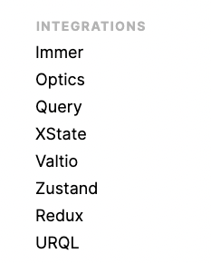 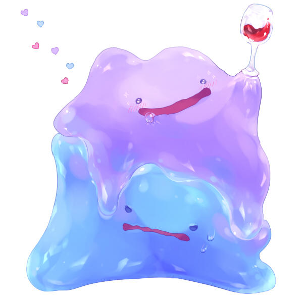

---

# 적용사례

- [jotai 공식문서](https://jotai.org/)
- [카카오 스타일 Jotai 적용 사례](https://devblog.croquis.com/ko/2022-01-13-1-frontend-state-management/)
- [화해팀 jotai 적용 사례](http://blog.hwahae.co.kr/all/tech/tech-tech/6099/)

---

# 감사합니다.


---

# 설문

설문 URL : https://works.do/FQQIwSt


